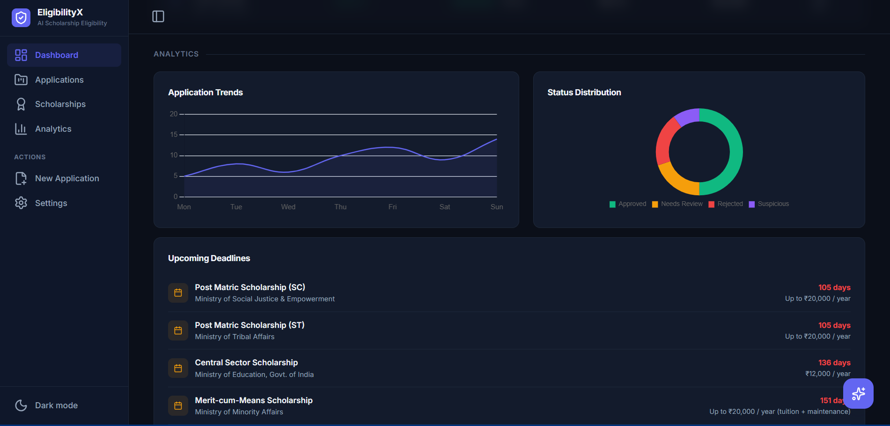

# 🎓 EligibilityX

> AI-Powered Scholarship Eligibility & Verification Platform

EligibilityX is a smart scholarship management platform that automates eligibility verification, document validation, scholarship recommendation, and applicant analysis using OCR, rule-based intelligence, and Generative AI.

The system helps educational institutions, government agencies, NGOs, and scholarship providers streamline the scholarship screening process while reducing manual effort and improving transparency.

---


## ✨ Features

### 🤖 AI Scholarship Recommendation Engine

* Recommends scholarships based on:

  * Academic performance
  * Family income
  * Category
  * Course
  * Gender
* Calculates scholarship match scores

### 📄 OCR-Based Document Verification

* Extracts information from uploaded documents
* Supports:

  * Aadhaar Card
  * Marksheet
  * Income Certificate
  * Bank Passbook
* Compares extracted text with submitted application data

### 🎯 Eligibility Scoring

* Generates an eligibility score for every applicant
* Evaluates:

  * Income criteria
  * Academic performance
  * Category eligibility
  * Document consistency

### 🔍 Duplicate Application Detection

* Detects duplicate applications using:

  * Aadhaar Number
  * Bank Account Details
  * Applicant Information

### 🧠 AI Explanation Engine

* Explains:

  * Approval decisions
  * Rejection reasons
  * Eligibility outcomes
  * Recommendation logic

### 💬 ScholarBot (Gemini AI Assistant)

* Interactive AI-powered scholarship assistant
* Answers scholarship-related questions
* Provides eligibility guidance
* Explains required documents and deadlines

### 📊 Analytics Dashboard

* Application statistics
* Approval rates
* Eligibility insights
* Recommendation highlights
* Scholarship analytics

---

## 🏗️ System Workflow

```text
Applicant
   │
   ▼
Application Form
   │
   ▼
OCR Verification
   │
   ▼
Eligibility Engine
   │
   ▼
Recommendation Engine
   │
   ▼
AI Explanation Engine
   │
   ▼
ScholarBot + Dashboard
```

---

## 🛠️ Technology Stack

### Frontend

* HTML5
* CSS3
* JavaScript
* Jinja2 Templates
* Chart.js
* Lucide Icons

### Backend

* Python
* Flask
* Flask-SQLAlchemy

### Database

* SQLite

### AI & NLP

* Google Gemini API

### OCR

* Tesseract OCR

### Utilities

* dotenv
* JSON Processing

---

## 📂 Project Structure

```text
EligibilityX/
│
├── app.py
├── migrate_db.py
├── requirements.txt
├── .env
│
├── models/
│   ├── __init__.py
│   └── database.py
│
├── templates/
│   ├── base.html
│   ├── dashboard.html
│   ├── apply.html
│   ├── detail.html
│   └── result.html
│
├── uploads/
│
├── utils/
│   ├── classifier.py
│   ├── deadlines.py
│   ├── eligibility.py
│   ├── explainer.py
│   ├── matcher.py
│   ├── ocr_engine.py
│   ├── scholarship_recommender.py
│   ├── scholarbot.py
│   └── seed.py
│
├── instance/
│   └── scholarship.db
│
└── static/
    ├── css/
    ├── js/
    └── images/
```

---

## ⚙️ Installation

### 1. Clone the Repository

```bash
git clone https://github.com/Mokshi-C/Scholarship-Detector.git
cd Scholarship-Detector
```

### 2. Create Virtual Environment

```bash
python -m venv venv
```

### Activate Virtual Environment

#### Windows

```bash
venv\Scripts\activate
```

#### Linux / macOS

```bash
source venv/bin/activate
```

### 3. Install Dependencies

```bash
pip install -r requirements.txt
```

### 4. Configure Environment Variables

Create a `.env` file in the root directory:

```env
GEMINI_API_KEY=YOUR_GEMINI_API_KEY
```

### 5. Run the Application

```bash
python app.py
```

Open:

```text
http://127.0.0.1:5000
```

---

## 💬 ScholarBot

ScholarBot is an AI-powered scholarship assistant integrated into EligibilityX.

### Example Queries

* What scholarships am I eligible for?
* What documents are required?
* Tell me about AICTE Pragati Scholarship.
* Explain my eligibility score.
* What scholarships are available for OBC students?

Powered by Google Gemini.

---

## 📈 Future Enhancements

* PDF Document Support
* Voice-Enabled ScholarBot
* Multi-Language Support
* Admin Authentication System
* Scholarship Web Scraping
* Email Notifications
* Export Reports as PDF
* Cloud Deployment
* Student Portal
* Real-Time Analytics

---

## 🔐 Security Features

* Environment Variable Protection
* File Upload Validation
* Duplicate Application Detection
* OCR-Based Verification
* Eligibility Rule Validation
* AI-Assisted Fraud Detection

---

## 🎯 Use Cases

* Government Scholarship Portals
* Educational Institutions
* Universities & Colleges
* NGOs
* CSR Scholarship Programs
* Educational Trusts

---

## 🌟 Highlights

✅ OCR-Based Document Verification

✅ AI Scholarship Recommendation Engine

✅ Eligibility Scoring System

✅ Duplicate Detection

✅ Gemini-Powered ScholarBot

✅ Interactive Dashboard

✅ Automated Verification Workflow

✅ Explainable AI Decisions


